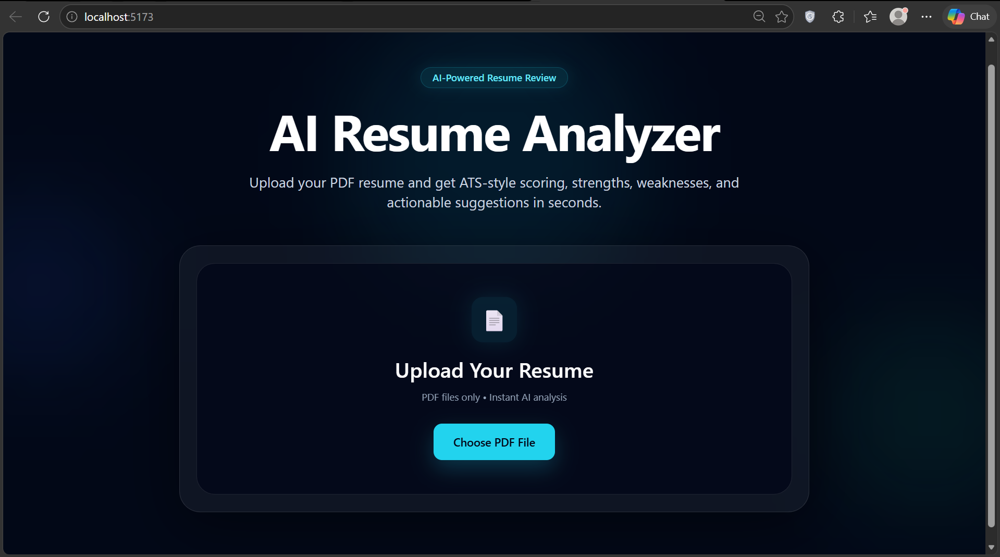
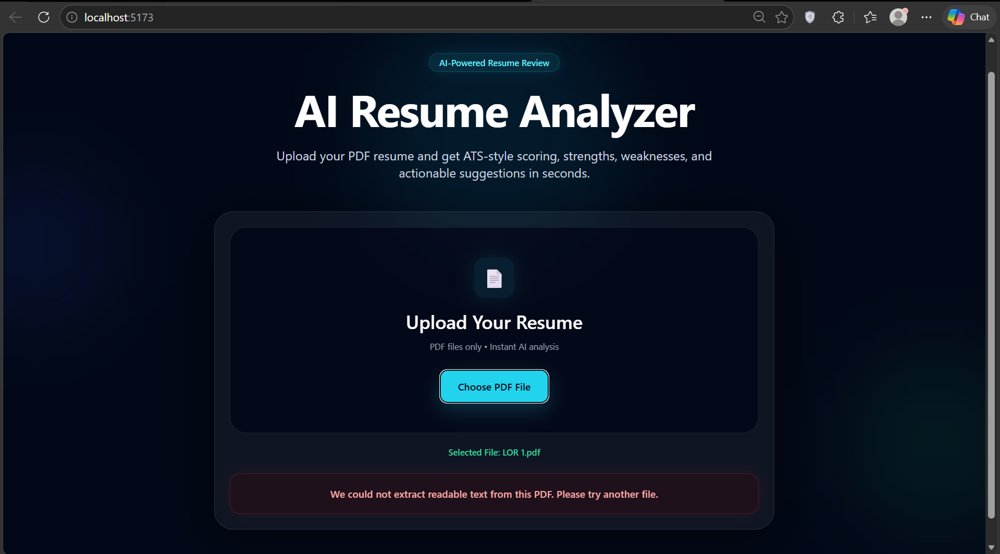
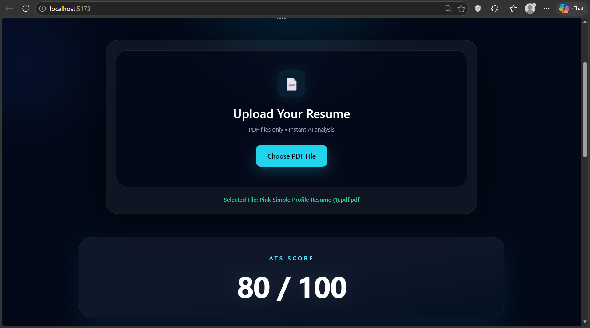
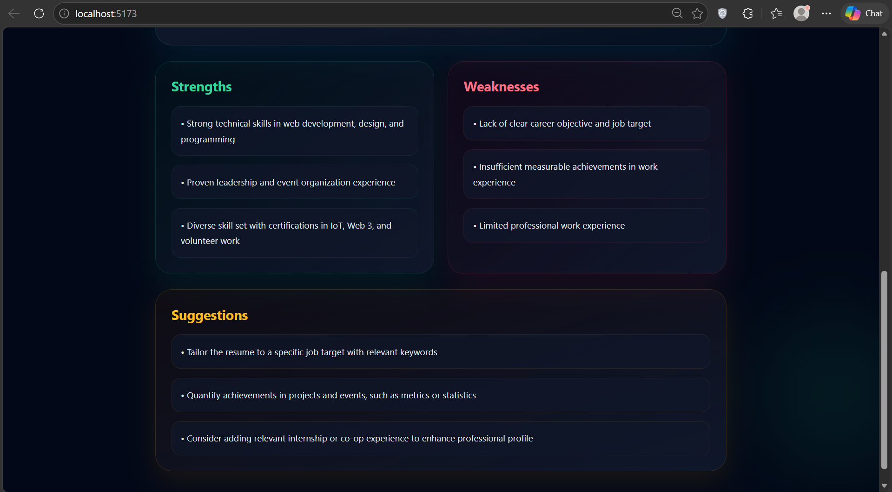

# 🚀 AI Resume Analyzer

A full-stack AI-powered web application that analyzes resumes and provides ATS-style scoring, strengths, weaknesses, and actionable improvement suggestions.

Built from scratch using modern AI APIs, clean architecture, and a premium UI to simulate real-world resume evaluation systems.

---

## 🌐 Live Demo

🔗 Frontend:  
https://ai-resume-analyzer-eight-sigma.vercel.app

🔗 Backend API:  
https://ai-resume-analyzer-pbh7.onrender.com

---

## ✨ Features

- 📄 Upload resume in PDF format
- 🤖 AI-based resume analysis using LLaMA 3
- 📊 ATS-style score (0–100)
- 💪 Strength identification
- ⚠️ Weakness detection
- 💡 Actionable suggestions for improvement
- 🧠 Smart resume validation (detects non-resume PDFs)
- ⚡ Real-time analysis with loading state
- 🎨 Modern dark UI with premium design

---

## 🛠️ Tech Stack

### Frontend

- React (Vite)
- Tailwind CSS
- React Dropzone

### Backend

- FastAPI (Python)
- PyPDF2 (PDF text extraction)
- Groq API (LLaMA 3 model)

---

## 📸 Screenshots

### 🏠 Home Page



---

### ❌ Invalid File Handling



---

### 📊 ATS Score Result



---

### 📋 Full Analysis Output



---

## ⚙️ Installation & Setup

### 1. Clone the repository

```bash
git clone https://github.com/Dhruv-0612/ai-resume-analyzer.git
cd ai-resume-analyzer
```

---

### 2. Frontend Setup

```bash
npm install
npm run dev
```

Frontend will run at:

```
http://localhost:5173
```

---

### 3. Backend Setup

```bash
cd backend
python -m venv venv
venv\Scripts\activate
pip install -r requirements.txt
```

---

### 4. Add Environment Variables

Create a file:

```
backend/.env
```

Add your Groq API key:

```
GROQ_API_KEY=your_api_key_here
```

---

### 5. Run Backend Server

```bash
uvicorn main:app --reload
```

Backend will run at:

```
http://127.0.0.1:8000
```

---

## 🧠 How It Works

1. User uploads a PDF resume
2. Backend extracts text using PyPDF2
3. AI validates whether the file is a resume
4. Resume is analyzed using LLaMA 3 model
5. JSON response is generated
6. Frontend displays results

---

## 🔒 Security

- API keys stored in `.env`
- `.env` ignored via `.gitignore`
- No secrets exposed in code

---

## 📈 Future Improvements

- Job-role based analysis
- Resume vs job description matching
- Export results as PDF
- Authentication system

---

## 👨‍💻 Author

**Dhruv Hiteshbhai Mistry**
📍 India  
🔗 https://github.com/Dhruv-0612
